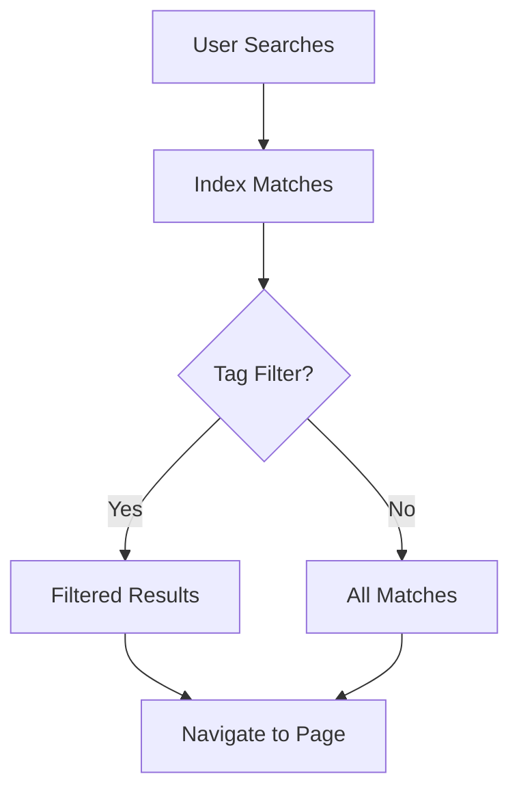

## Overview

rshelekhov provides powerful tools to manage your project documentation effectively. You organize content into structured spaces, edit with advanced formatting options, collaborate with team members in real-time, and navigate large documentation sets quickly. These core features help you maintain clear, up-to-date docs that scale with your projects.

## Organize Content Efficiently

Structure your documentation using folders, tags, and hierarchical pages. This keeps everything accessible and logically grouped.

<Columns cols={3}>
  <Card title="Folders" icon="folder" href="#folders">
    Create nested folders to mirror your project structure.
  </Card>
  <Card title="Tags" icon="tag" href="#tags">
    Apply tags for cross-referencing related topics.
  </Card>
  <Card title="Page Hierarchy" icon="layout" href="#hierarchy">
    Build outlines with parent-child relationships.
  </Card>
</Columns>

### Folders and Tags in Action

<Steps>
  <Step title="Create a Folder" icon="folder-plus">
    Navigate to your space root and select **New Folder**. Name it `api-reference`.
  </Step>
  <Step title="Add Tags" icon="tag">
    Open a page, click **Tags**, and add `api`, `v1.0`.
  </Step>
  <Step title="Link Pages" icon="link">
    Use `[API Docs](/api-reference)` to create internal links.
  </Step>
</Steps>

## Edit and Format Documents

You edit pages using visual rich text or full MDX support for custom components.

<Tabs>
  <Tab title="Rich Text Editor" icon="edit-3">
    Use the WYSIWYG editor for quick formatting. Add bold, lists, and embeds without code.
  </Tab>
  <Tab title="MDX Mode" icon="code">
    Switch to MDX for advanced layouts.

````mdx
<Callout kind="tip">
  Pro tip: Use `{brandColor: '#3B82F6'}` in custom components.
</Callout>
````

  </Tab>
</Tabs>

<CodeGroup tabs="Markdown,MDX">
```markdown
# Welcome

- **Bold** text
- *Italic* emphasis
```
```mdx
## Advanced Section

<Card title="Feature" icon="star">
  Custom cards enhance readability.
</Card>
```
</CodeGroup>

## Collaborate with Your Team

Invite members, assign roles, and track changes.

<Callout kind="info">
  Real-time editing lets multiple users work simultaneously without conflicts.
</Callout>

| Role | Permissions |
|------|-------------|
| Admin | Full access, invite users |
| Editor | Edit pages, manage folders |
| Viewer | Read-only access |

Use version history to revert changes:

````bash
git log --oneline
a1b2c3d Update collaboration guide
e4f5g6h Add search feature
````

## Search and Navigate Seamlessly

Full-text search indexes all content. Use filters for tags and folders.



<Expandable title="Advanced Search Tips" default-open="false">

Combine keywords: `api +auth` finds pages with both terms. Bookmark frequent searches for quick access.

</Expandable>

Explore these features to streamline your workflow. Start by organizing a new space today.